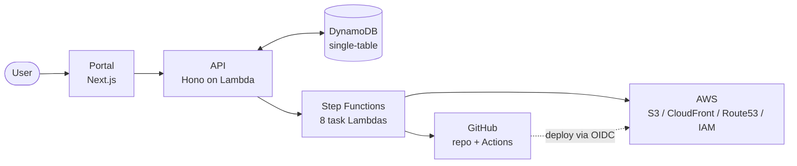

# Ironforge

A self-service Internal Developer Platform on AWS. Built as a portfolio project; explores serverless workflow orchestration, security boundaries between platform and tenant code, and verification discipline at integration boundaries.

## Live demo

[**portfolio-demo.ironforge.rickycaballero.com**](https://portfolio-demo.ironforge.rickycaballero.com) is a static site provisioned by Ironforge, hosted on the platform itself, telling the platform's own story. ([source](https://github.com/ironforge-svc/portfolio-demo))

## What is this

Ironforge provisions static websites end-to-end. A user fills a wizard, clicks Provision, and the platform stands up an S3 origin, a CloudFront distribution with a custom subdomain on the wildcard ACM cert, a Route53 alias, and an IAM deploy role; creates a GitHub repository with starter code and a deploy workflow; and wires the two together so pushes to the repo's `main` branch deploy via GitHub Actions OIDC. The whole flow takes about 5 minutes.

What it isn't: a multi-tenant SaaS, a general-purpose platform, or a Kubernetes story. It's a single-tenant IDP demonstrating the platform-engineering pattern (opinionated curated module plus user inputs) on a single template (static website). Adding additional templates is incremental work, not a rewrite.

## Architecture



The portal authenticates against Cognito, calls the API for create/read/list/delete, and reads job state from a single DynamoDB table. `POST /api/services` kicks off a Step Functions execution that runs eight task Lambdas in sequence: `validate-inputs`, `create-repo`, `generate-code`, `run-terraform`, `wait-for-cloudfront`, `trigger-deploy`, `wait-for-deploy`, `finalize`. Each task Lambda has a single responsibility and its own narrow IAM role. Compensating actions run on failure to clean up half-provisioned state. `DELETE /api/services/:id` runs a separate two-state deprovisioning workflow.

For depth:

- [docs/PROJECT_OVERVIEW.md](docs/PROJECT_OVERVIEW.md): system overview and locked decisions
- [docs/state-machine.md](docs/state-machine.md): Step Functions workflow execution detail
- [docs/data-model.md](docs/data-model.md): DynamoDB single-table design and access patterns
- [docs/adrs/](docs/adrs/): 8 architectural decision records

## Engineering highlights

**Container Lambda with bundled Terraform.** The AWS provider is too big for a Lambda layer (the 250MB limit), so I packaged `run-terraform` as a container image instead of moving the work into CodeBuild. One Lambda runs `terraform apply` over `child_process.spawn`, with about 4× headroom on the 15-minute timeout for the static-site template. Empirical revisit triggers in [ADR-009](docs/adrs/009-run-terraform-execution-model.md) move the work to CodeBuild if a future template's apply approaches the timeout ceiling, but at current scale, the simpler architecture earns itself.

**Template-derived IAM.** Each template declares an `allowedResourceTypes` list in its manifest, and the run-terraform Lambda's IAM policy is generated from that list via `generateRunTerraformPolicy()` in `packages/template-renderer/`. If I add a resource type to the manifest without updating the IAM mapping, the next provision fails closed at the AWS API layer with `AccessDenied`. That's the point. Drift surfaces loudly at apply time rather than silently letting IAM grow broader than the manifest declares.

**Code/infra separation via repo secrets.** Ironforge has zero runtime presence on the deploy path. The `trigger-deploy` Lambda populates three GitHub repository secrets (`IRONFORGE_DEPLOY_ROLE_ARN`, `IRONFORGE_BUCKET_NAME`, `IRONFORGE_DISTRIBUTION_ID`) at provisioning time. After that, the deployed repo deploys itself via GitHub Actions OIDC against a per-service deploy role: the user pushes to `main`, GitHub Actions runs `aws s3 sync` and a CloudFront invalidation, and the platform never sees the request. The OIDC trust binds AWS to the GitHub repo identity directly, so the platform isn't on the runtime hot path for ongoing deploys.

## How I worked

**8 ADRs** for non-obvious decisions, amended when reality refined them. ADR-002 ("managed vs inline IAM") got an empirical-reality amendment after AWS rejected a managed-policy attachment that the original criteria approved. ADR-009 ("single Lambda, no CodeBuild") got two amendments after measured apply times prompted recalibration of the timeout triggers.

**End-to-end verification** across two phases turned up issues unit tests hadn't caught: 15 fix-PRs in total. The mix: code and config bugs, IAM scope corrections from drift between intent and the deployed boundary, and platform-side calibration (timeout headroom after CloudFront tail-latency variance, CI path-filter additions). Each landed as a code fix, an IAM expansion, or a runbook entry. Verification became the integration test for the chain; pre-flight prerequisite checks in `scripts/verify-prerequisites.sh` complement it.

**Tech-debt ledger with promotion triggers.** Every deferred item lives in `docs/tech-debt.md` with a "when to revisit" condition. The cleanup-on-failure destroy chain was promoted from tech-debt to active work mid-Phase-1 when the manual-cleanup tax exceeded the implementation cost.

**Conventions documented** in `docs/conventions.md`: template substitution boundaries, idempotency patterns, platform-IAM versus tenant-IAM, and other recurring decisions written down so the next engineer doesn't re-derive them.

## Project structure

```
apps/web/                       Next.js portal
services/api/                   Hono on Lambda
services/workflow/*             8 task Lambdas (Step Functions)
packages/shared-types           Zod schemas + TS types
packages/shared-utils           AWS clients, logger
packages/template-renderer      IAM policy generation, code generation
templates/static-site           Terraform module + starter-code + manifest
infra/                          Ironforge's own infrastructure (modules + envs)
docs/                           ADRs, runbook, conventions, tech-debt, etc.
demo/portfolio-demo-content/    Bespoke landing page for portfolio-demo (recovery source if the live repo is re-provisioned)
```

## Documentation

- [docs/PROJECT_OVERVIEW.md](docs/PROJECT_OVERVIEW.md): system overview and locked decisions
- [docs/state-machine.md](docs/state-machine.md): Step Functions workflow
- [docs/data-model.md](docs/data-model.md): DynamoDB single-table design
- [docs/conventions.md](docs/conventions.md): engineering standards
- [docs/runbook.md](docs/runbook.md): operational procedures
- [docs/cost-safeguards.md](docs/cost-safeguards.md): budget actions and circuit breaker
- [docs/tech-debt.md](docs/tech-debt.md): deferred work with promotion triggers
- [docs/adrs/](docs/adrs/): 8 architectural decision records
- [docs/retros/](docs/retros/): phase retros
- [docs/EMERGENCY.md](docs/EMERGENCY.md): break-glass procedures

## Status

Phase 1.5 closed (2026-05-04). Provision and deprovision flows verified end-to-end against real AWS infrastructure; the live `portfolio-demo` URL above is the canonical artifact. Phase 2 is in scope-definition; in-flight orphan handling and async destroy via Step Functions polling are tracked in `docs/tech-debt.md` as the load-bearing items.

## Things I'd do differently

**Budget against tail-latency from day one.** The original 600s `run-terraform` Lambda timeout was budgeted against nominal CloudFront apply time (3m47s nominal, 4× headroom on paper). The math worked for the median, but CloudFront's tail-latency variance is real and predictable in retrospect. Phase 1.5 verification surfaced it via a single timed-out apply, and 900s became the right ceiling. It would have been the right starting point too. The lesson generalizes: any infrastructure budget calibrated against nominal leaves a hidden cliff in the long tail; calibrating against worst-case observation costs nothing up front.

**Integration tests from day 1.** Integration testing infrastructure earned its keep at phase-end verification; it would have earned more if built progressively. A CI pipeline running smoke provisioning on every PR would have surfaced integration bugs in 5-minute cycles instead of multi-day phase-end iterations. The lesson is transferable across projects: verify integration boundaries continuously, not at phase boundaries.
